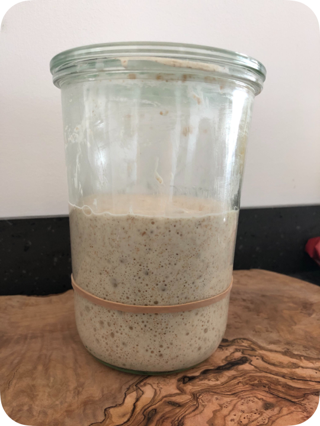

# Sourdough recipe

My no knead sourdough recipe. 🍞

Tried, tested and adapted over time. 

Archived here for future reference purposes.

## Refresher videos

Video | URL
--|--
Sourdough Masterclass - Patrick Ryan | https://www.youtube.com/watch?v=2FVfJTGpXnU
No knead Sourdough - Bake with Jack | https://www.youtube.com/watch?v=vmb0wWKITBQ
Sourdough recipe - The boy who bakes | https://www.youtube.com/watch?v=NBcIMj3gf74

## Starter (_Swampy_)

100% hydration, equal quantities of:
- Existing starter
- Rye flour
- Water

## Ingredients

Ingredient | Quantity
--|--
Starter | 80g
Water | 300g
Flour (see below) | 400g
Table salt | 8g

#### 400g Flour variations

Bread type | Amount | Remarks
--|--|--
Just right | 100g country grain flour + 300g strong white flour | Delicious combo
Half half | 200g wholemeal flour + 200g strong white flour | Healthy?
All white | 400g strong white flour | Basic staple, not a lot of depth in flavour

## Method (making the dough)

Step | Task | Duration until next step
--|--|--
1 | Remove starter from the fridge (40g) add 40g rye flour and 40ml water, mix well and keep at room temperature out of the sun. (_Protip: Use rubber band to indicate the original volume, see above image_) | Wait until volume has doubled (2-6 hours)
2 | Spoon 80g of risen starter into a large mixing bowl, put remaining 40g starter back into the fridge | 
3 | Add 300ml water into the same bowl, mix well | 
4 | Add 400g flour (see above for types), and 8g of table salt, mix until no dry parts left, cover with lid | Wait 30 minutes
5 | Stretch and fold (12 times), cover with lid | Wait 2 hours
6 | Stretch and fold (4 times), cover with lid | Wait 2 hours
7 | Stretch and fold (4 times), cover with lid | Wait 1 hour
8 | Onto a lightly floured surface, tip out the dough, stretch and fold (4 times) and form into a ball, cover with bowl | Wait 1 hour
9 | Dust lightly with flour, flip over, stretch and fold (4 times) and form into a ball, place ball into a lightly buttered loaf tin, cover with cling film | Straight into fridge or leave out for 1-2 hours to rise a bit more
10 | Put loaf tin into the fridge | Overnight

## Method (baking)

Step | Task | Duration until next step
--|--|--
1 | Turn oven on bread baking mode at 240 degrees celcius | Until oven has reached 240
2 | Take loaf tin out of the fridge, remove cling film, score straight down the middle |
3 | Put loaf tin in the oven, with approx 100ml of water in the bottom oven tray (for steam), close the oven door | 5 minutes
4 | Turn oven down to 190 degrees celcius | 25-30 minutes (until the top is dark brown)
5 | Turn off oven, tip loaf onto a cooling rack | 30 minutes to cool
6 | Enjoy with lashings of Lurpak butter 🤤 | 
